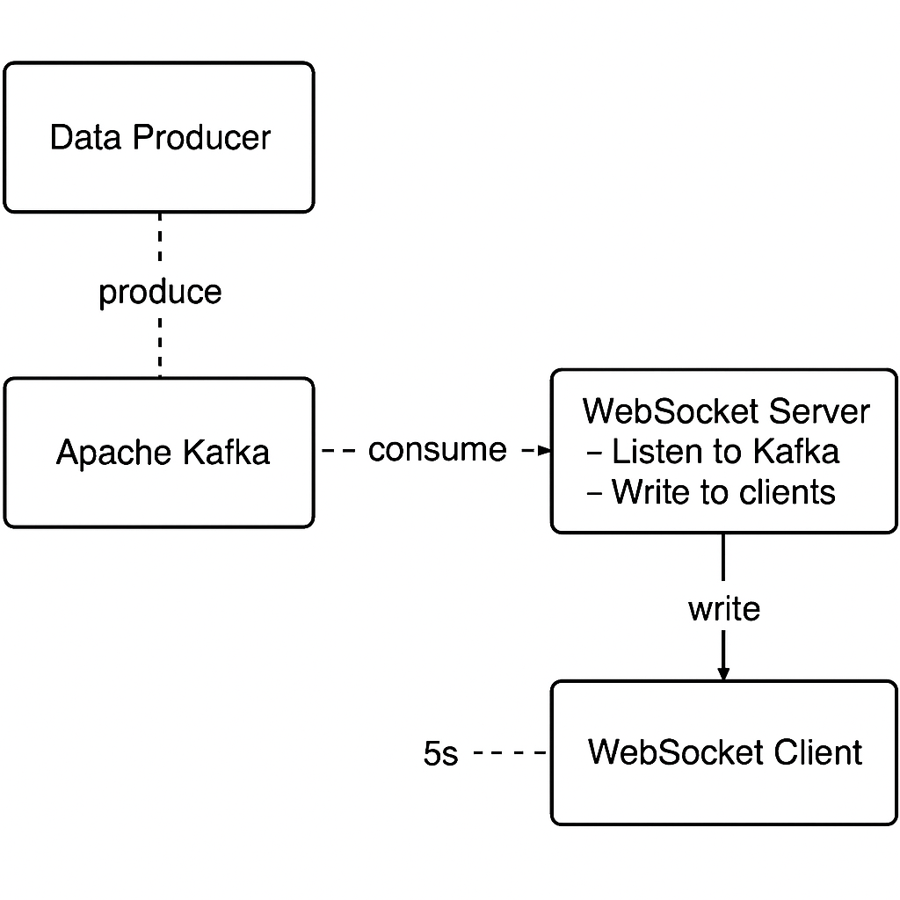

#  📊 FLUJO DE DATOS

```text
       Servicio externo
           ↓ produce
   ┌───────────────────────────────┐
   │        Apache Kafka           │
   │    (topic: "bus-updates")     │
   └───────────────────────────────┘
           ↓ consume
   ┌─────────────────────────────────────┐
   │        Servidor Go                 │
   │     (kafkaConsumerLoop)            │
   │  - Escucha Kafka                   │
   │  - Reenvía a clientes WebSocket    │
   └─────────────────────────────────────┘
           ↓ write
   ┌────────────────────────────┐
   │     Cliente WebSocket      │
   │  (web/app, frontend, etc.) │
   └────────────────────────────┘


# 🚌 Bus Real Time Processor

Este módulo implementa el procesamiento de datos en tiempo real utilizando **Apache Kafka**, **Apache Spark** y un **simulador de datos**. La arquitectura está contenida dentro de Docker para el despliegue.

---

## 📦 Componentes del Sistema

| Servicio     | Descripción                                                                 |
|--------------|------------------------------------------------------------------------------|
| Zookeeper    | Sistema de coordinación requerido por Kafka.                                |
| Kafka        | Cola de mensajes distribuida, recibe datos del simulador y alimenta a Spark.|
| Spark        | Consume los datos de Kafka y realiza procesamiento en streaming.            |
| Simulador    | Genera eventos y los envía a Kafka. |

---

## 🛠️ Requisitos Previos

- [Docker](https://www.docker.com/get-started) instalado
- [Docker Compose](https://docs.docker.com/compose/) (si no usas Docker Desktop)
- Recomendado: Python 3.8+ (para depuración o scripts locales si los hubiera)

---

## 🚀 Cómo levantar el sistema

```bash
docker compose up --build
